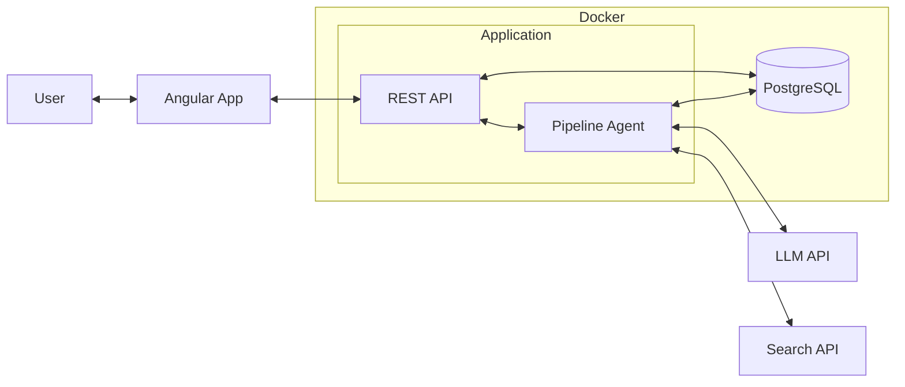
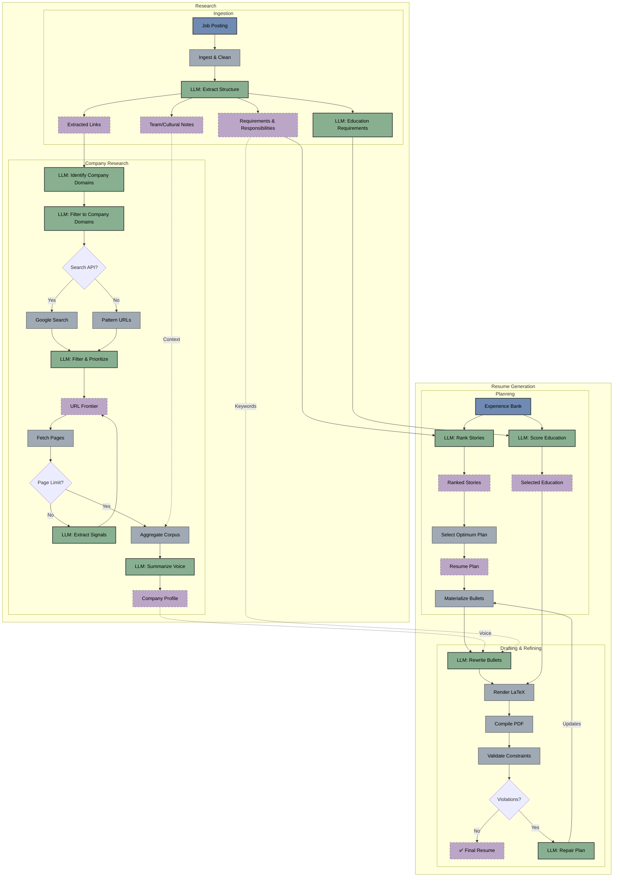

# Resume Customizer

## 1. Introduction

Resume Customizer is a local tool (with a planned hosted version) that tailors your LaTeX resume to a specific job posting. It uses LLMs to analyze the job description and your experience bank, rewriting bullet points to match the required skills and "vibe." This backend service can be accessed via the [Angular frontend application](https://github.com/jonkmatsumo/resume-customizer-frontend) which provides a user-friendly interface for managing your experience bank and generating tailored resumes.

[**API Docs**](https://jonkmatsumo.github.io/resume-customizer/) | [**OpenAPI Spec**](openapi/openapi.yaml) | [**Frontend Application**](https://github.com/jonkmatsumo/resume-customizer-frontend)

| Agent | Function |
|-------|----------|
| Requirement Extraction | Identifies key skills and qualifications from job descriptions |
| Company Research | Analyzes company websites to understand tone and values |
| Experience Selection | Matches professional stories to job requirements |
| Content Tailoring | Rewrites bullet points to align with job keywords and company style |
| Layout Validation | Checks document fits on one page and adheres to formatting rules |

---

## 2. Architecture

At a high level, the system runs as a containerized Go application with PostgreSQL for data persistence:



The system uses hybrid ranking (deterministic heuristics + LLM semantic evaluation), validation loops that compile LaTeX and check the PDF, and persists all data to PostgreSQL in normalized relational tables. Under the hood, the pipeline orchestrates specialized agents that pass validated data between stages—green nodes below indicate LLM-powered steps:



---

## 3. Frontend Application

This backend service is designed to work with the **[Resume Customizer Frontend](https://github.com/jonkmatsumo/resume-customizer-frontend)**, a modern Angular 21 interface that provides a user-friendly way to interact with the agentic pipeline.

The frontend application offers:

- **Authentication & Profile Management**: Manage user identity and profile data
- **Employment History Editor**: Curate your "Experience Bank"—the source of truth for the agents
- **Resume Generation Workflow**:
  - Start pipeline runs with a job URL
  - Real-time progress tracking via Server-Sent Events (SSE)
  - Artifact inspection (extracted keywords, company cultural notes)
  - Download final tailored LaTeX/PDF resumes

For setup instructions and more details, see the [frontend repository](https://github.com/jonkmatsumo/resume-customizer-frontend).

---

## 4. REST API

The service exposes a comprehensive REST API. For full documentation including all endpoints, parameters, and schemas, please view the interactive API docs.

### Viewing the API Documentation

The documentation is available online at **[https://jonkmatsumo.github.io/resume-customizer/](https://jonkmatsumo.github.io/resume-customizer/)**.

To preview or validate locally:

```bash
# Lint the spec
npx -y @stoplight/spectral-cli lint openapi/openapi.yaml

# Preview locally (opens browser)
npx -y @redocly/cli preview-docs openapi/openapi.yaml
```

### Key Examples

Here are the most common operations to get you started:

#### 1. Start a Pipeline Run (Streaming)

```bash
# Note: Use -N to see the stream immediately
curl -N -X POST http://localhost:8080/run/stream \
  -H "Content-Type: application/json" \
  -d '{
    "user_id": "550e8400-e29b-41d4-a716-446655440000",
    "job_url": "https://www.linkedin.com/jobs/view/123456789"
  }'
```

The first SSE event will be `run_started` containing the `run_id` for tracking:
```
event: step
data: {"step":"run_started","category":"lifecycle","message":"Pipeline run started","run_id":"..."}
```

#### 2. Check Run Status

```bash
curl http://localhost:8080/status/{run_id}
```

#### 3. Download Generated Resume

```bash
# Use -O to save the file with the remote filename
curl -O http://localhost:8080/runs/{run_id}/resume.tex
```

---

## 5. Quick Start with Docker

To run this application locally first install [Docker Desktop](https://www.docker.com/products/docker-desktop/).

### Setup

```bash
# 1. Clone and configure environment
cp .env.example .env
# Edit .env and add your GEMINI_API_KEY

# 2. Start the service
docker compose up -d

# 3. Test the API
curl http://localhost:8080/health
```

---

## 6. Configuration

### Environment Variables

| Variable | Required | Description |
|----------|----------|-------------|
| `GEMINI_API_KEY` | Yes | [Google Gemini](https://makersuite.google.com/app/apikey) API key |
| `DATABASE_URL` | Auto | PostgreSQL connection string |
| `GOOGLE_SEARCH_API_KEY` | No | Enables company website discovery |
| `GOOGLE_SEARCH_CX` | No | Custom Search Engine ID |
| `BCRYPT_COST` | No | Bcrypt work factor for password hashing (default: 12, range: 10-14) |
| `PASSWORD_PEPPER` | No | Optional global secret for additional password security. Generate with: `openssl rand -base64 32` (32 bytes recommended to stay within bcrypt's 72-byte limit) |

---

## 7. Development

### Testing & Linting

```bash
make test   # Run unit tests
make lint   # Static analysis
make ci     # All quality checks
```

### Running the Server Locally

```bash
# Build the binary
make build

# Run the server (requires DATABASE_URL and GEMINI_API_KEY env vars)
./bin/resume_agent serve --port 8080
```

### Docker Commands

```bash
docker compose build app     # Rebuild
docker compose logs -f app   # View logs
docker compose down -v       # Reset database
```
