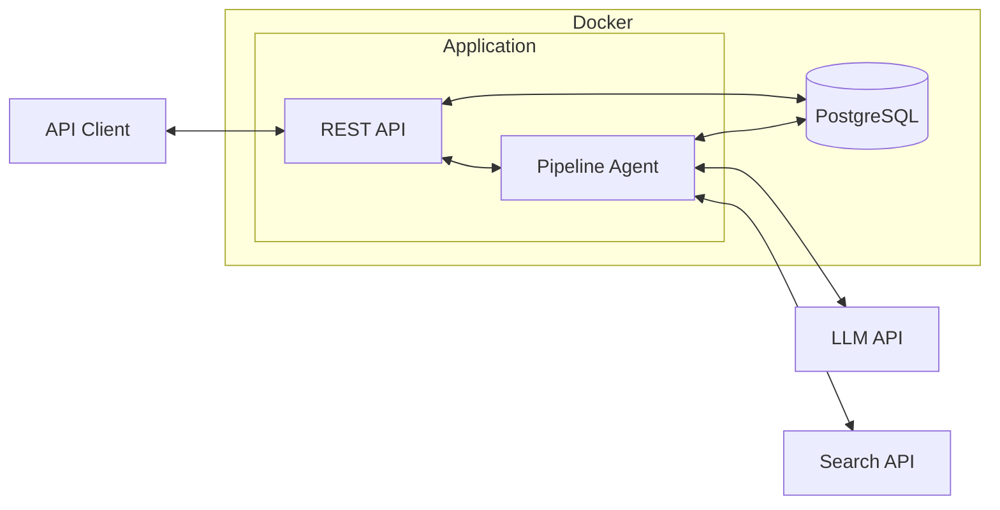
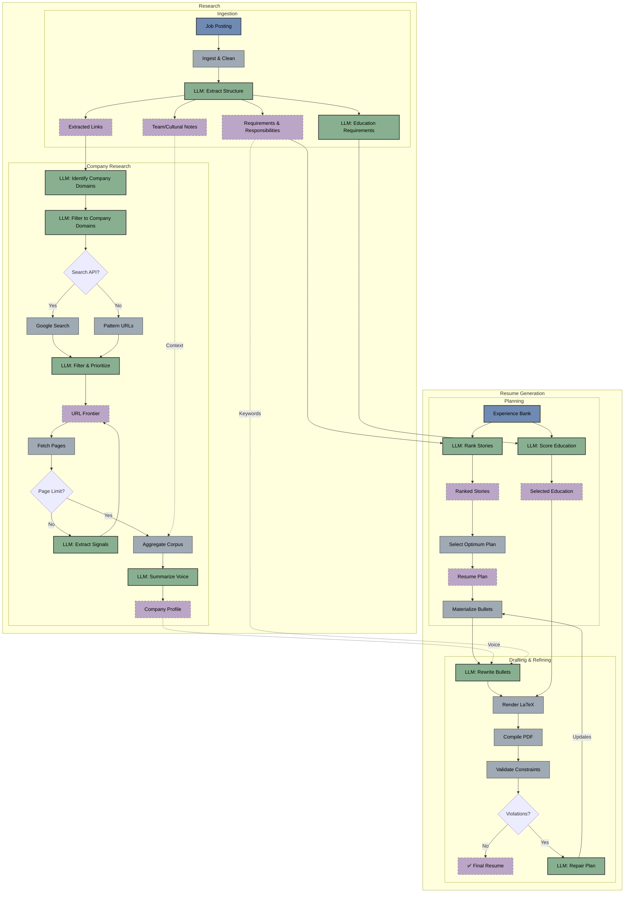

# Resume Customizer

## 1. Introduction

Resume Customizer is a local tool (with a planned hosted version) that tailors your LaTeX resume to a specific job posting. It uses an LLM (Gemini 1.5 Pro) to analyze the job description and your experience bank, rewriting bullet points to match the required skills and "vibe."

[**API Docs**](docs/api/index.html) | [**OpenAPI Spec**](docs/api/openapi.yaml)

| Agent | Function |
|-------|----------|
| Requirement Extraction | Identifies key skills and qualifications from job descriptions |
| Company Research | Analyzes company websites to understand tone and values |
| Experience Selection | Matches professional stories to job requirements |
| Content Tailoring | Rewrites bullet points to align with job keywords and company style |
| Layout Validation | Checks document fits on one page and adheres to formatting rules |

---

## 2. Architecture

At a high level, the system runs as a containerized Go application with PostgreSQL for artifact persistence:



The system uses hybrid ranking (deterministic heuristics + LLM semantic evaluation), validation loops that compile LaTeX and check the PDF, and persists every artifact to PostgreSQL for debugging. Under the hood, the pipeline orchestrates specialized agents that pass validated data between stages—green nodes below indicate LLM-powered steps:



---

## 3. REST API

The service exposes a comprehensive REST API. For full documentation including all endpoints, parameters, and schemas, please view the interactive API docs.

### Viewing the API Documentation

The documentation is available as a static HTML file that renders the OpenAPI specification.

```bash
# Serve the documentation locally
python3 -m http.server --directory docs/api 8000
```

Then visit [http://localhost:8000](http://localhost:8000) in your browser.

### Key Examples

Here are the most common operations to get you started:

#### 1. Start a Pipeline Run (Streaming)

```bash
# Note: Use -N to see the stream immediately
curl -N -X POST http://localhost:8080/run/stream \
  -H "Content-Type: application/json" \
  -d '{
    "user_id": "550e8400-e29b-41d4-a716-446655440000",
    "job_url": "https://www.linkedin.com/jobs/view/123456789"
  }'
```

#### 2. Check Run Status

```bash
curl http://localhost:8080/status/{run_id}
```

#### 3. Download Generated Resume

```bash
# Use -O to save the file with the remote filename
curl -O http://localhost:8080/runs/{run_id}/resume.tex
```

---

## 4. Quick Start with Docker

### Prerequisites
*   **Docker Desktop** (includes Docker Compose)
*   **Google Gemini API Key**: [Get it here](https://makersuite.google.com/app/apikey)
*   *(Optional)* **Google Search API** for company research

### Setup

```bash
# 1. Clone and configure environment
cp .env.example .env
# Edit .env and add your GEMINI_API_KEY

# 2. Start the service
docker compose up -d

# 3. Test the API
curl http://localhost:8080/health
```

---

## 5. Configuration

### Environment Variables

| Variable | Required | Description |
|----------|----------|-------------|
| `GEMINI_API_KEY` | Yes | Google Gemini API key |
| `DATABASE_URL` | Auto | PostgreSQL connection string |
| `GOOGLE_SEARCH_API_KEY` | No | Enables company website discovery |
| `GOOGLE_SEARCH_CX` | No | Custom Search Engine ID |

### API Request Fields

| Field | Description |
|-------|-------------|
| `job_url` | URL to fetch job posting from |
| `job` | Path to job text file (alternative) |
| `user_id` | UUID of user in DB (required) |
| `name`, `email`, `phone` | Candidate contact info |
| `template` | LaTeX template path |
| `max_bullets`, `max_lines` | Layout constraints |

---

## 6. Database & Artifacts

All artifacts persist to PostgreSQL for history and debugging.

### Artifact Categories

| Category | Steps |
|----------|-------|
| ingestion | job_posting, job_profile, education_requirements |
| experience | experience_bank, ranked_stories, resume_plan, selected_bullets |
| research | sources, company_corpus, company_profile |
| rewriting | rewritten_bullets |
| validation | resume_tex, violations |

### User Profile Schema

The system now supports storing user profiles in PostgreSQL:

*   **users**: Core profile (name, email, phone)
*   **jobs**: Employment history linked to user
*   **experiences**: Bullet points linked to jobs, with embedded `skills` (JSONB) and `risk_flags`
*   **education**: Academic history linked to user

### Database Queries

```bash
# List runs
docker compose exec db psql -U resume -d resume_customizer \
  -c "SELECT id, company, status FROM pipeline_runs;"

# Get artifacts for a run
docker compose exec db psql -U resume -d resume_customizer \
  -c "SELECT step, category FROM artifacts WHERE run_id='YOUR_ID';"
```

---

## 7. Development

### Testing & Linting

```bash
make test   # Run unit tests
make lint   # Static analysis
make ci     # All quality checks
```

### CLI (Internal)

The CLI is for local development and debugging:

```bash
./bin/resume_agent run --config config.json --verbose
./bin/resume_agent serve --port 8080
```

### Docker Commands

```bash
docker compose build app     # Rebuild
docker compose logs -f app   # View logs
docker compose down -v       # Reset database
```
