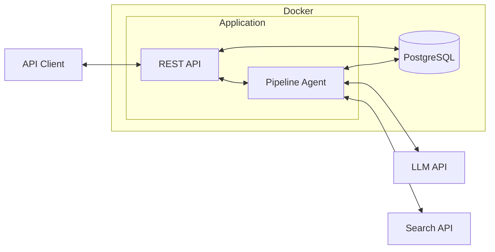
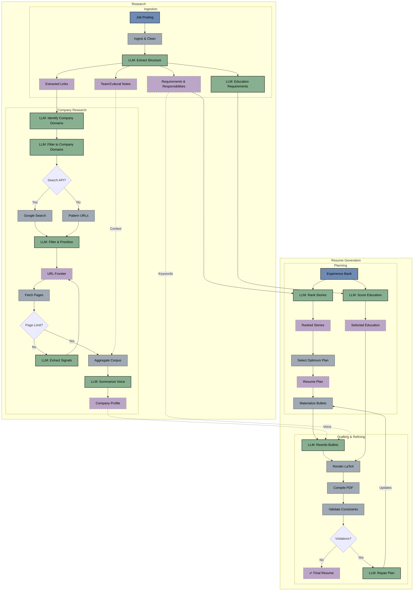

# Resume Customizer

## 1. Introduction

Resume Customizer is a multi-agentic system that automates the tailoring of resumes to specific job postings. It processes a job description, researches the target company, and selects relevant experiences from a user's professional history to generate a focused, one-page LaTeX resume.

| Agent | Function |
|-------|----------|
| Requirement Extraction | Identifies key skills and qualifications from job descriptions |
| Company Research | Analyzes company websites to understand tone and values |
| Experience Selection | Matches professional stories to job requirements |
| Content Tailoring | Rewrites bullet points to align with job keywords and company style |
| Layout Validation | Checks document fits on one page and adheres to formatting rules |

---

## 2. Architecture

At a high level, the system runs as a containerized Go application with PostgreSQL for artifact persistence:



The system uses hybrid ranking (deterministic heuristics + LLM semantic evaluation), validation loops that compile LaTeX and check the PDF, and persists every artifact to PostgreSQL for debugging. Under the hood, the pipeline orchestrates specialized agents that pass validated data between stages—green nodes below indicate LLM-powered steps:



---

## 3. REST API

The service exposes a REST API for triggering pipelines and retrieving results.

### Pipeline Endpoints

| Method | Endpoint | Description |
|--------|----------|-------------|
| `POST /run` | Start pipeline (background) | Returns run ID immediately |
| `POST /run/stream` | Start pipeline (SSE) | Streams progress events |
| `GET /health` | Health check | Returns `{"status":"ok"}` |

### Run Management

| Method | Endpoint | Description |
|--------|----------|-------------|
| `GET /runs` | List all runs | Filter: `?company=&status=&limit=` |
| `GET /status/{id}` | Get run status | Status, company, role |
| `DELETE /runs/{id}` | Delete run | Cascades to artifacts |

### Artifact Retrieval

| Method | Endpoint | Description |
|--------|----------|-------------|
| `GET /artifacts` | List artifacts | Filter: `?run_id=&step=&category=` |
| `GET /artifact/{id}` | Get artifact by ID | Full JSON content |
| `GET /runs/{id}/artifacts` | List run's artifacts | Summary view |
| `GET /runs/{id}/resume.tex` | Download LaTeX | Plain text download |

### User Profile Management

| Method | Endpoint | Description |
|--------|----------|-------------|
| `POST /users` | Create User | Body: `{"name","email","phone"}` |
| `GET /users/{id}` | Get User | Returns user profile |
| `PUT /users/{id}` | Update User | Update fields |
| `GET /users/{id}/jobs` | List Jobs | Returns employment history |
| `POST /users/{id}/jobs` | Create Job | Body: `{"company","role_title",...}` |
| `PUT /jobs/{id}` | Update Job | Body: `{"company","role_title",...}` |
| `DELETE /jobs/{id}` | Delete Job | Deletes job and experiences |
| `GET /jobs/{id}/experiences` | List Experiences | Returns bullet points |
| `POST /jobs/{id}/experiences` | Add Experience | Body: `{"bullet_text","skills",...}` |
| `PUT /experiences/{id}` | Update Experience | Body: `{"bullet_text","skills",...}` |
| `DELETE /experiences/{id}` | Delete Experience | Deletes bullet point |
| `GET /users/{id}/education` | List Education | Returns education history |
| `POST /users/{id}/education` | Add Education | Body: `{"school","degree",...}` |
| `PUT /education/{id}` | Update Education | Body: `{"school","degree",...}` |
| `DELETE /education/{id}` | Delete Education | Deletes education entry |
| `GET /users/{id}/experience-bank` | Export Experience JSON | Returns pipeline-compatible format |

### API Request Fields

| Field | Type | Required? | Description |
| :--- | :--- | :--- | :--- |
| `job_url` | string | **Yes** (or `job`) | URL of the job posting |
| `job` | string | **Yes** (or `job_url`) | Path to local job posting file |
| `user_id` | string | **Yes** | UUID of the user profile in DB |
| `template` | string | No | Path to LaTeX template (default: `templates/one_page_resume.tex`) |
| `max_bullets` | int | No | Target number of bullets (default: 25) |
| `max_lines` | int | No | Target number of lines (default: 35) |

### Example: Start Pipeline

```bash
curl -X POST http://localhost:8080/run \
  -H "Content-Type: application/json" \
  -d '{
    "user_id": "550e8400-e29b-41d4-a716-446655440000",
    "job_url": "https://www.linkedin.com/jobs/view/123456789"
  }'
```

### Example: Retrieve Results

```bash
# List runs
curl http://localhost:8080/runs?status=completed

# Get artifacts for a run
curl http://localhost:8080/runs/{run_id}/artifacts

# Download resume
curl http://localhost:8080/runs/{run_id}/resume.tex -o resume.tex
```

---

## 4. Quick Start with Docker

### Prerequisites
*   **Docker Desktop** (includes Docker Compose)
*   **Google Gemini API Key**: [Get it here](https://makersuite.google.com/app/apikey)
*   *(Optional)* **Google Search API** for company research

### Setup

```bash
# 1. Clone and configure environment
cp .env.example .env
# Edit .env and add your GEMINI_API_KEY

# 2. Start the service
docker compose up -d

# 3. Test the API
curl http://localhost:8080/health
```

---

## 5. Configuration

### Environment Variables

| Variable | Required | Description |
|----------|----------|-------------|
| `GEMINI_API_KEY` | Yes | Google Gemini API key |
| `DATABASE_URL` | Auto | PostgreSQL connection string |
| `GOOGLE_SEARCH_API_KEY` | No | Enables company website discovery |
| `GOOGLE_SEARCH_CX` | No | Custom Search Engine ID |

### API Request Fields

| Field | Description |
|-------|-------------|
| `job_url` | URL to fetch job posting from |
| `job` | Path to job text file (alternative) |
| `user_id` | UUID of user in DB (required) |
| `name`, `email`, `phone` | Candidate contact info |
| `template` | LaTeX template path |
| `max_bullets`, `max_lines` | Layout constraints |

---

## 6. Database & Artifacts

All artifacts persist to PostgreSQL for history and debugging.

### Artifact Categories

| Category | Steps |
|----------|-------|
| ingestion | job_posting, job_profile, education_requirements |
| experience | experience_bank, ranked_stories, resume_plan, selected_bullets |
| research | sources, company_corpus, company_profile |
| rewriting | rewritten_bullets |
| validation | resume_tex, violations |

### User Profile Schema

The system now supports storing user profiles in PostgreSQL:

*   **users**: Core profile (name, email, phone)
*   **jobs**: Employment history linked to user
*   **experiences**: Bullet points linked to jobs, with embedded `skills` (JSONB) and `risk_flags`
*   **education**: Academic history linked to user

### Database Queries

```bash
# List runs
docker compose exec db psql -U resume -d resume_customizer \
  -c "SELECT id, company, status FROM pipeline_runs;"

# Get artifacts for a run
docker compose exec db psql -U resume -d resume_customizer \
  -c "SELECT step, category FROM artifacts WHERE run_id='YOUR_ID';"
```

---

## 7. Development

### Testing & Linting

```bash
make test   # Run unit tests
make lint   # Static analysis
make ci     # All quality checks
```

### CLI (Internal)

The CLI is for local development and debugging:

```bash
./bin/resume_agent run --config config.json --verbose
./bin/resume_agent serve --port 8080
```

### Docker Commands

```bash
docker compose build app     # Rebuild
docker compose logs -f app   # View logs
docker compose down -v       # Reset database
```
