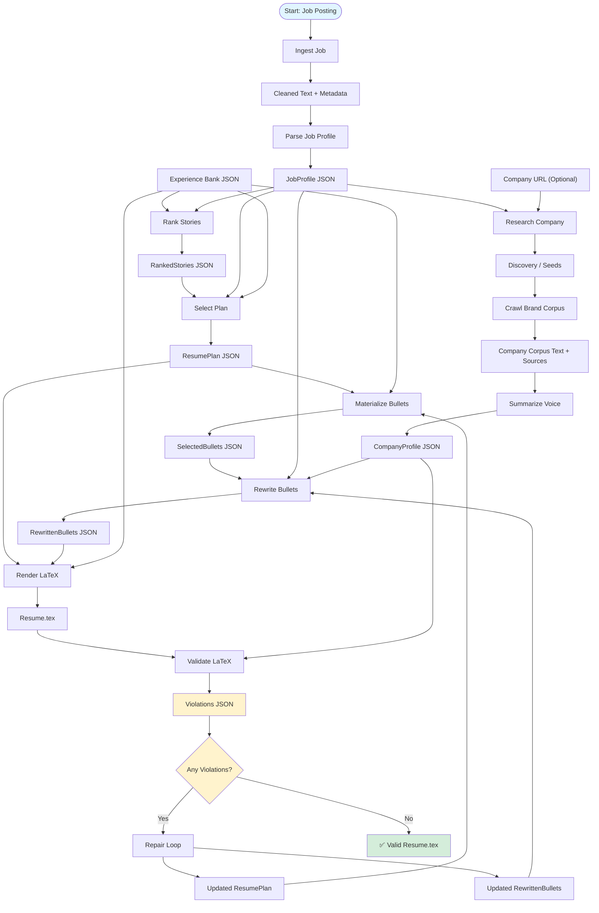

# Resume Customizer

A **schema-first, CLI-driven, multi-step agent** that generates a **strictly formatted, one-page LaTeX resume** tailored to a specific job posting and company brand voice. The resume generation pipeline follows a deterministic, step-by-step process where each stage produces validated artifacts that feed into the next stage. The system emphasizes **schema-first design** (every intermediate artifact conforms to JSON schemas), **CLI-driven workflows** (each step runs independently with explicit inputs/outputs), **deterministic logic** (explicit heuristics over "the model will figure it out"), and **debuggability** (all intermediate artifacts are saved and inspectable).

## Pipeline Flow

The following diagram shows the complete state transitions through the resume generation pipeline:



### Pipeline Stages

1. **Job Ingestion** (`ingest-job`): Cleans job posting text from file or URL
2. **Job Parsing** (`parse-job`): Extracts structured JobProfile using LLM
3. **Story Ranking** (`rank-stories`): Ranks experience stories by relevance to job (internally builds weighted skill targets from JobProfile for scoring)
4. **Plan Selection** (`plan`): Selects optimal stories and bullets using knapsack algorithm (internally builds weighted skill targets from JobProfile for coverage scoring)
5. **Bullet Materialization** (`materialize`): Extracts selected bullet data from ExperienceBank
6. **Brand Voice Acquisition** (`crawl-brand`): Crawls company website and builds text corpus
7. **Voice Summarization** (`summarize-voice`): Extracts brand voice and style rules using LLM
8. **Bullet Rewriting** (`rewrite`): Rewrites bullets to match job requirements and company brand voice
9. **LaTeX Rendering** (`render-latex`): Generates LaTeX resume from template
10. **Validation** (`validate-latex`): Validates resume against constraints (page count, line length, forbidden phrases)
11. **Repair Loop** (`repair`): Automatically fixes violations and re-validates

**Note**: The `build-skill-targets` command is available for inspection/debugging purposes to see the weighted skill targets, but it's not required in the pipeline flow since skill targets are built internally by `rank-stories` and `plan`.

## Quick Start

### Prerequisites

- Go 1.21 or later
- Make (optional, for convenience commands)
- Google Gemini API key (required for LLM-based commands)
  - Get your API key from [Google AI Studio](https://makersuite.google.com/app/apikey)
  - Set it as `GEMINI_API_KEY` environment variable or use `--api-key` flag
- LaTeX distribution (required for validation):
  - TeX Live (recommended) or MiKTeX
  - `pdfinfo` (from poppler-utils) or `ghostscript` (for page counting in validation)

### Build

```bash
# Install dependencies
go mod tidy

# Build binary
make build
# or
go build -o bin/resume_agent ./cmd/resume_agent
```

### Basic Usage

#### 1. Ingest Job Posting

```bash
# From text file
make resume-ingest-job ARGS="--text-file posting.txt --out artifacts/"

# From URL
make resume-ingest-job ARGS="--url https://jobs.company.com/123 --out artifacts/"
```

#### 2. Parse Job Profile

```bash
export GEMINI_API_KEY=your-api-key-here

make resume-parse-job ARGS="--in artifacts/job_posting.cleaned.txt --out artifacts/job_profile.json"

# Validate output
make resume-validate ARGS="--schema schemas/job_profile.schema.json --json artifacts/job_profile.json"
```

#### 3. Build Skill Targets

```bash
make resume-build-skill-targets ARGS="--job-profile artifacts/job_profile.json --out artifacts/skill_targets.json"
```

#### 4. Rank Experience Stories

```bash
make resume-rank-stories ARGS="--job-profile artifacts/job_profile.json --experience experience_bank.json --out artifacts/ranked_stories.json"
```

#### 5. Select Resume Plan

```bash
make resume-plan ARGS="--ranked artifacts/ranked_stories.json --job-profile artifacts/job_profile.json --experience experience_bank.json --max-bullets 8 --max-lines 45 --out artifacts/resume_plan.json"
```

#### 6. Materialize Selected Bullets

```bash
make resume-materialize ARGS="--plan artifacts/resume_plan.json --experience experience_bank.json --out artifacts/selected_bullets.json"
```

#### 7. Acquire Company Brand Voice

```bash
# Crawl company website
make resume-crawl-brand ARGS="--seed-url https://company.com --max-pages 10 --out artifacts/"

# Summarize brand voice
make resume-summarize-voice ARGS="--in artifacts/company_corpus.txt --sources artifacts/company_corpus.sources.json --out artifacts/company_profile.json"
```

#### 8. Rewrite Bullets

```bash
make resume-rewrite ARGS="--selected artifacts/selected_bullets.json --job-profile artifacts/job_profile.json --company-profile artifacts/company_profile.json --out artifacts/rewritten_bullets.json"
```

#### 9. Render LaTeX Resume

```bash
make resume-render-latex ARGS="--plan artifacts/resume_plan.json --bullets artifacts/rewritten_bullets.json --experience experience_bank.json --template templates/one_page_resume.tex --name \"John Doe\" --email \"john@example.com\" --phone \"555-1234\" --out artifacts/resume.tex"
```

#### 10. Validate Resume

```bash
make resume-validate-latex ARGS="--in artifacts/resume.tex --company-profile artifacts/company_profile.json --max-pages 1 --max-chars 90 --out artifacts/violations.json"
```

## CLI Commands Reference

All commands can be run via Make aliases using `make resume-<command> ARGS="..."`. Replace example paths with your actual file paths.

### Core Commands

#### `validate`
Validate a JSON file against a JSON Schema.

```bash
make resume-validate ARGS="--schema schemas/job_profile.schema.json --json artifacts/job_profile.json"
```

**Flags:**
- `--schema`, `-s`: Path to JSON Schema file (required)
- `--json`, `-j`: Path to JSON file to validate (required)

**Exit Codes:**
- `0`: Validation passed
- `1`: Validation failed
- `2`: Usage error or schema loading error

#### `ingest-job`
Ingest a job posting from a text file or URL.

```bash
make resume-ingest-job ARGS="--text-file job_posting.txt --out artifacts/"
# or
make resume-ingest-job ARGS="--url https://company.com/jobs/123 --out artifacts/"
```

**Flags:**
- `--text-file`, `-t`: Path to text file containing job posting
- `--url`, `-u`: URL to fetch job posting from
- `--out`, `-o`: Output directory (required)

#### `parse-job`
Parse a cleaned job posting into structured JobProfile JSON.

```bash
make resume-parse-job ARGS="--in artifacts/job_posting.cleaned.txt --out artifacts/job_profile.json"
```

**Flags:**
- `--in`, `-i`: Path to cleaned job posting text file (required)
- `--out`, `-o`: Path to output JobProfile JSON file (required)
- `--api-key`: Gemini API key (overrides GEMINI_API_KEY env var)

#### `build-skill-targets`
Build weighted skill targets from a JobProfile. This command is primarily for inspection/debugging purposes, as skill targets are built internally by `rank-stories` and `plan` commands.

```bash
make resume-build-skill-targets ARGS="--job-profile artifacts/job_profile.json --out artifacts/skill_targets.json"
```

**Flags:**
- `--job-profile`, `-j`: Path to JobProfile JSON file (required)
- `--out`, `-o`: Path to output SkillTargets JSON file (required)

#### `load-experience`
Load and normalize an ExperienceBank JSON file.

```bash
make resume-load-experience ARGS="--in experience_bank.json --out artifacts/experience_bank_normalized.json"
```

**Flags:**
- `--in`, `-i`: Path to ExperienceBank JSON file (required)
- `--out`, `-o`: Path to output normalized ExperienceBank JSON file (required)

#### `rank-stories`
Rank experience stories by relevance to a job posting.

```bash
make resume-rank-stories ARGS="--job-profile artifacts/job_profile.json --experience artifacts/experience_bank_normalized.json --out artifacts/ranked_stories.json"
```

**Flags:**
- `--job-profile`, `-j`: Path to JobProfile JSON file (required)
- `--experience`, `-e`: Path to ExperienceBank JSON file (required)
- `--out`, `-o`: Path to output RankedStories JSON file (required)

#### `plan`
Select optimal stories and bullets using knapsack algorithm.

```bash
make resume-plan ARGS="--ranked artifacts/ranked_stories.json --job-profile artifacts/job_profile.json --experience artifacts/experience_bank_normalized.json --max-bullets 8 --max-lines 45 --out artifacts/resume_plan.json"
```

**Flags:**
- `--ranked`, `-r`: Path to RankedStories JSON file (required)
- `--job-profile`, `-j`: Path to JobProfile JSON file (required)
- `--experience`, `-e`: Path to ExperienceBank JSON file (required)
- `--max-bullets`: Maximum number of bullets allowed (required)
- `--max-lines`: Maximum number of lines allowed (required)
- `--out`, `-o`: Path to output ResumePlan JSON file (required)

#### `materialize`
Extract selected bullets from ExperienceBank based on ResumePlan.

```bash
make resume-materialize ARGS="--plan artifacts/resume_plan.json --experience artifacts/experience_bank_normalized.json --out artifacts/selected_bullets.json"
```

**Flags:**
- `--plan`, `-p`: Path to ResumePlan JSON file (required)
- `--experience`, `-e`: Path to ExperienceBank JSON file (required)
- `--out`, `-o`: Path to output SelectedBullets JSON file (required)

#### `crawl-brand`
Crawl company website and build text corpus for brand voice analysis.

```bash
make resume-crawl-brand ARGS="--seed-url https://company.com --max-pages 10 --out artifacts/"
```

**Flags:**
- `--seed-url`, `-u`: Company website URL to start crawling from (required)
- `--max-pages`: Maximum number of pages to crawl (default: 10, max: 15)
- `--out`, `-o`: Output directory (required)
- `--api-key`: Gemini API key (overrides GEMINI_API_KEY env var, required for link classification)

#### `summarize-voice`
Extract brand voice and style rules from company corpus.

```bash
make resume-summarize-voice ARGS="--in artifacts/company_corpus.txt --sources artifacts/company_corpus.sources.json --out artifacts/company_profile.json"
```

**Flags:**
- `--in`, `-i`: Path to corpus text file (required)
- `--sources`, `-s`: Path to sources JSON file (required)
- `--out`, `-o`: Path to output CompanyProfile JSON file (required)
- `--api-key`: Gemini API key (overrides GEMINI_API_KEY env var)

#### `rewrite`
Rewrite selected bullets to match job requirements and company brand voice.

```bash
make resume-rewrite ARGS="--selected artifacts/selected_bullets.json --job-profile artifacts/job_profile.json --company-profile artifacts/company_profile.json --out artifacts/rewritten_bullets.json"
```

**Flags:**
- `--selected`, `-s`: Path to SelectedBullets JSON file (required)
- `--job-profile`, `-j`: Path to JobProfile JSON file (required)
- `--company-profile`, `-c`: Path to CompanyProfile JSON file (required)
- `--out`, `-o`: Path to output RewrittenBullets JSON file (required)
- `--api-key`: Gemini API key (overrides GEMINI_API_KEY env var)

#### `render-latex`
Render LaTeX resume from template.

```bash
make resume-render-latex ARGS="--plan artifacts/resume_plan.json --bullets artifacts/rewritten_bullets.json --template templates/one_page_resume.tex --name \"John Doe\" --email \"john@example.com\" --phone \"555-1234\" --out artifacts/resume.tex --experience artifacts/experience_bank_normalized.json"
```

**Flags:**
- `--plan`, `-p`: Path to ResumePlan JSON file (required)
- `--bullets`, `-b`: Path to RewrittenBullets JSON file (required)
- `--template`, `-t`: Path to LaTeX template file (default: `templates/one_page_resume.tex`)
- `--name`, `-n`: Candidate name (required)
- `--email`, `-e`: Candidate email (required)
- `--phone`: Candidate phone number (optional)
- `--experience`, `-e`: Path to ExperienceBank JSON file (optional, needed for company/role/dates)
- `--out`, `-o`: Path to output LaTeX file (required)

#### `validate-latex`
Validate LaTeX resume against constraints.

```bash
make resume-validate-latex ARGS="--in artifacts/resume.tex --out artifacts/violations.json --company-profile artifacts/company_profile.json --max-pages 1 --max-chars 90"
```

**Flags:**
- `--in`, `-i`: Path to LaTeX file (required)
- `--out`, `-o`: Path to output Violations JSON file (required)
- `--company-profile`, `-c`: Path to CompanyProfile JSON file (optional, needed for taboo phrase checking)
- `--max-pages`: Maximum page count (default: 1)
- `--max-chars`: Maximum characters per line (default: 90)

**Exit Codes:**
- `0`: No violations found
- `1`: Violations found
- `2`: Error during validation process

**Dependencies:**
- `pdflatex`: Required for LaTeX compilation
- `pdfinfo` (preferred) or `ghostscript`: Required for PDF page counting

#### `repair`
Automatically repair LaTeX resume violations by proposing and applying repair actions iteratively.

```bash
make resume-repair ARGS="--plan artifacts/resume_plan.json --bullets artifacts/rewritten_bullets.json --violations artifacts/violations.json --ranked artifacts/ranked_stories.json --job-profile artifacts/job_profile.json --company-profile artifacts/company_profile.json --experience artifacts/experience_bank_normalized.json --name \"John Doe\" --email \"john@example.com\" --out artifacts/"
```

**Flags:**
- `--plan`, `-p`: Path to ResumePlan JSON file (required)
- `--bullets`, `-b`: Path to RewrittenBullets JSON file (required)
- `--violations`, `-v`: Path to Violations JSON file (required)
- `--ranked`, `-r`: Path to RankedStories JSON file (required)
- `--job-profile`, `-j`: Path to JobProfile JSON file (required)
- `--company-profile`, `-c`: Path to CompanyProfile JSON file (required)
- `--experience`, `-e`: Path to ExperienceBank JSON file (required)
- `--template`, `-t`: Path to LaTeX template file (default: `templates/one_page_resume.tex`)
- `--name`, `-n`: Candidate name (required)
- `--email`: Candidate email (required)
- `--phone`: Candidate phone (optional)
- `--max-pages`: Maximum page count (default: 1)
- `--max-chars`: Maximum characters per line (default: 90)
- `--max-iterations`: Maximum repair iterations (default: 5)
- `--api-key`: Gemini API key (overrides GEMINI_API_KEY env var)
- `--out`, `-o`: Output directory (required)

## Development

### Running Tests

```bash
# Run all tests
make test

# Run tests with coverage
make test-coverage

# Run tests with race detector
make test-race
```

### Linting and Formatting

```bash
# Run linter
make lint

# Format code
make fmt

# Check formatting (CI)
make fmt-check
```

### CI Checks

```bash
# Run all CI checks (format, lint, test, build)
make ci
```

## Project Structure

```
.
├── cmd/
│   └── resume_agent/          # CLI entrypoint and commands
├── internal/
│   ├── crawling/              # Website crawling and corpus building
│   ├── experience/            # ExperienceBank loading and normalization
│   ├── ingestion/             # Job posting ingestion (file/URL)
│   ├── parsing/               # JobProfile extraction using LLM
│   ├── ranking/               # Story ranking algorithms
│   ├── rendering/             # LaTeX rendering
│   ├── repair/                # Violation repair (not yet implemented)
│   ├── rewriting/             # Bullet rewriting using LLM
│   ├── schemas/               # JSON schema validation
│   ├── selection/             # ResumePlan selection (knapsack)
│   ├── skills/                # Skill target building
│   ├── types/                 # Go type definitions
│   ├── validation/            # LaTeX validation
│   └── voice/                 # Brand voice summarization
├── schemas/                   # JSON Schema definitions
├── templates/                 # LaTeX templates
├── testdata/                  # Test fixtures
└── docs/                      # Documentation
```

## Schema Validation

All intermediate artifacts conform to JSON schemas defined in `schemas/`. Validate any artifact using:

```bash
make resume-validate ARGS="--schema schemas/job_profile.schema.json --json artifacts/job_profile.json"
```

Available schemas:
- `job_profile.schema.json`
- `skill_targets.schema.json`
- `experience_bank.schema.json`
- `ranked_stories.schema.json`
- `resume_plan.schema.json`
- `bullets.schema.json`
- `company_profile.schema.json`
- `violations.schema.json`
- `repair_actions.schema.json`
- `state.schema.json`

## Design Principles

- **Schema-First**: Every artifact must conform to a JSON schema
- **CLI-Driven**: Every step runs independently from the command line
- **Deterministic**: Prefer explicit heuristics over "the model will figure it out"
- **Debuggable**: All intermediate artifacts are saved and inspectable
- **Incremental**: Build and test each component before moving to the next

