# Resume Customizer

## 1. Introduction

Resume Customizer is a multi-agentic system that automates the tailoring of resumes to specific job postings. It processes a job description, researches the target company, and selects relevant experiences from a user's professional history to generate a focused, one-page LaTeX resume.

The system utilizes specialized AI agents to handle different stages of the process:
*   **Requirement Extraction**: Identifies key skills and qualifications from job descriptions.
*   **Company Research**: Analyzes company websites to understand their tone and values.
*   **Experience Selection**: Matches professional stories to job requirements based on relevance.
*   **Content Tailoring**: Rewrites bullet points to align with job keywords and company style.
*   **Layout Validation**: Checks that the document fits on one page and adheres to formatting rules.

---

## 2. The Multi-Agent Workflow

The pipeline orchestrates specialized agents that pass validated data between stages to ensure the final resume meets both job requirements and physical layout constraints.

```mermaid
graph TD
    Start([Start: Job Posting]) --> IngestJob[Ingest Job]
    IngestJob --> CleanedText[Cleaned Text + Metadata]
    
    CleanedText --> ParseJob[Parse Job Profile]
    ParseJob --> JobProfile[JobProfile JSON]
    
    ExperienceBank[Experience Bank JSON] --> RankStories[Rank Stories]
    JobProfile --> RankStories
    RankStories --> RankedStories[RankedStories JSON]
    
    RankedStories --> SelectPlan[Select Plan]
    JobProfile --> SelectPlan
    ExperienceBank --> SelectPlan
    SelectPlan --> ResumePlan[ResumePlan JSON]
    
    ResumePlan --> Materialize[Materialize Bullets]
    ExperienceBank --> Materialize
    Materialize --> SelectedBullets[SelectedBullets JSON]
    
    JobProfile --> Research[Research Company]
    CompanyURL["Company URL (Optional)"] --> Research
    Research --> Seeds[Discovery / Seeds]
    
    Seeds --> CrawlBrand[Crawl Brand Corpus]
    CrawlBrand --> CompanyCorpus[Company Corpus Text + Sources]
    
    CompanyCorpus --> SummarizeVoice[Summarize Voice]
    SummarizeVoice --> CompanyProfile[CompanyProfile JSON]
    
    SelectedBullets --> Rewrite[Rewrite Bullets]
    JobProfile --> Rewrite
    CompanyProfile --> Rewrite
    Rewrite --> RewrittenBullets[RewrittenBullets JSON]
    
    ResumePlan --> RenderLaTeX[Render LaTeX]
    RewrittenBullets --> RenderLaTeX
    ExperienceBank --> RenderLaTeX
    RenderLaTeX --> LaTeXFile[Resume.tex]
    
    LaTeXFile --> Validate[Validate LaTeX]
    CompanyProfile --> Validate
    Validate --> Violations[Violations JSON]
    
    Violations --> CheckViolations{Any Violations?}
    CheckViolations -->|Yes| Repair[Repair Loop]
    CheckViolations -->|No| FinalResume[✅ Valid Resume.tex]
    
    Repair --> UpdatedPlan[Updated ResumePlan]
    Repair --> UpdatedBullets[Updated RewrittenBullets]
    UpdatedPlan --> Materialize
    UpdatedBullets --> Rewrite
    
    style Start fill:#e1f5ff
    style FinalResume fill:#d4edda
    style Violations fill:#fff3cd
    style CheckViolations fill:#fff3cd
```



---

## 3. Setup and Basic Usage

### Prerequisites
*   **Go 1.21+**
*   **Google Gemini API Key**: [Get it here](https://makersuite.google.com/app/apikey).
*   **LaTeX Distribution**: (e.g., TeX Live) for document compilation.
*   **pdfinfo/ghostscript**: For page-count validation.

### Setup
```bash
# 1. Install dependencies
go mod tidy

# 2. Build the tool
make build

# 3. Configure environment
cp .env.example .env
# Edit .env and add your GEMINI_API_KEY
```

### Full Pipeline Run
Use the `run` command to process all stages from ingestion to final PDF generation.

```bash
make resume-run ARGS="--job job.txt \
                     --experience history.json \
                     --company-seed https://company.com \
                     --out output/ \
                     --name \"Jane Smith\" \
                     --email \"jane@example.com\""
```

---

## 4. Detailed Step-by-Step Breakdown

Each stage of the pipeline can be run individually for debugging or manual adjustments.

### Stage 1: Job Ingestion
Cleans raw text or HTML into a standard text format.
*   **Command**: `make resume-ingest-job ARGS="--text-file posting.txt --out artifacts/"`

### Stage 2: Job Parsing
Extracts structured requirements and skills.
*   **Command**: `make resume-parse-job ARGS="--in artifacts/job_posting.cleaned.txt --out artifacts/job_profile.json"`

### Stage 3: Experience Normalization
Ensures professional history is in the standard format used by the tool.
*   **Command**: `make resume-load-experience ARGS="--in history.json --out artifacts/history_normalized.json"`

### Stage 4: Experience Ranking
Scores professional stories against the parsed job requirements.
*   **Command**: `make resume-rank-stories ARGS="--job-profile artifacts/job_profile.json --experience artifacts/history_normalized.json --out artifacts/ranked_stories.json"`

### Stage 5: Layout Planning
Selects the optimal combination of bullets to fit a one-page layout.
*   **Command**: `make resume-plan ARGS="--ranked artifacts/ranked_stories.json --job-profile artifacts/job_profile.json --experience artifacts/history_normalized.json --max-bullets 8 --max-lines 45 --out artifacts/resume_plan.json"`

### Stage 6: Brand Voice Extraction
Researches the company tone and preferred communication style.
*   **Command**: `make resume-crawl-brand ARGS="--seed-url https://company.com --out artifacts/"`
*   **Next**: `make resume-summarize-voice ARGS="--in artifacts/company_corpus.txt --sources artifacts/sources.json --out artifacts/brand_profile.json"`

### Stage 7: Bullet Rewriting
Tailors bullet point text for keyword relevance and tone.
*   **Command**: `make resume-rewrite ARGS="--selected bullets.json --job-profile job.json --company-profile brand_profile.json --out tailored.json"`

### Stage 8: Rendering & Validation
Generates the LaTeX file and checks for formatting violations.
*   **Command**: `make resume-render-latex ARGS="--plan plan.json --bullets rewritten.json --experience history.json --out artifacts/resume.tex"`
*   **Validation**: `make resume-validate-latex ARGS="--in artifacts/resume.tex --out artifacts/violations.json"`

### Stage 9: Formatting Repair
Iteratively adjusts content to fix layout overflows or style violations.
*   **Command**: `make resume-repair ARGS="--plan plan.json --bullets rewritten.json --violations violations.json --job-profile job.json --out artifacts/"`

---

## 5. Technical Context and Constraints

### Architecture
Resume Customizer uses a **hybrid architecture** that combines deterministic algorithms with large language models (LLMs).
*   **Deterministic Logic**: Ranking and selection use explicit Go algorithms to ensure consistency and prevent "hallucinations" in experience selection.
*   **LLM Integration**: LLMs are used for semantic tasks like summarization and content tailoring.
*   **Validation Loops**: The system verifies its own output by compiling the LaTeX source and checking the resulting PDF against physical constraints.

### Key Constraints
*   **Page Budget**: The system enforces a strict one-page limit for the final document.
*   **Data Integrity**: Every intermediate file is validated against a JSON Schema to ensure data consistency between stages.
*   **Transparency**: Every step produces a readable JSON file, allowing users to inspect the system's reasoning at any point.

### Development

```bash
make test      # Run unit and integration tests
make lint      # Run static analysis
make ci        # Run all quality checks
```
